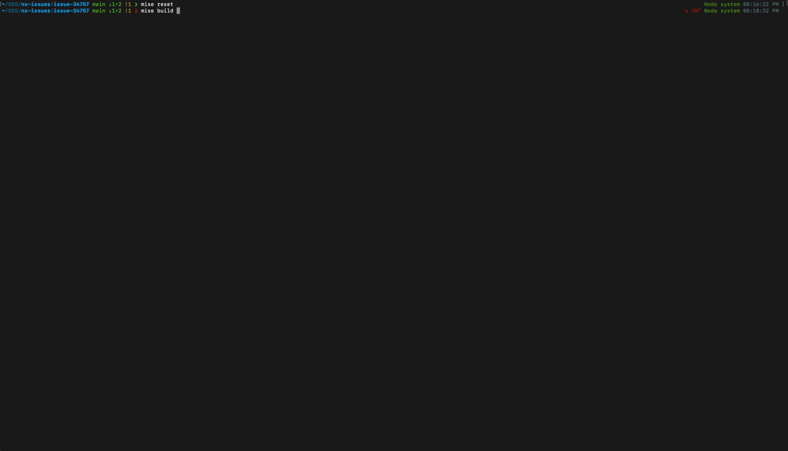

# Issue Reproduction: Nx Maven Plugin Hanging on Clean (Issue 34747)

https://github.com/nrwl/nx/issues/34758

This repository demonstrates an issue with the `@nx/maven` plugin when using `mise clean` (which triggers
`nx run-many -t mvn-clean`) in a complex project structure with multiple Maven modules.

## Issue Description

In this project, `mise build` works correctly because `nx` respects the dependencies between projects when building.
However, `mise clean` hangs and leaks logs when the number of projects exceeds the system's parallelism (available CPU
cores).

This occurs because the `clean` targets for different Maven projects are triggered simultaneously in parallel. Even
though they are "independent" clean targets, they may still have inter-dependencies (e.g., parent-child relationships,
`bom` dependencies) that cause conflicts or deadlocks when run in parallel without proper ordering, especially when the
task queue exceeds the available execution slots.

From observation, when the number of projects is less than the number of available cores, it runs fine. But when it
exceeds, the system hangs.

## Project Structure

The project follows a nested Maven structure:

- `java/pom.xml`: A parent project.
- `java/bom/`: A Bill of Materials (BOM) project with implicit dependencies.
- `java/app/`: A consumer application.
- `java/platform/libs/lib-1` through `lib-4`: Library modules.
- `java/platform/graal`: A GraalVM related module.

The project uses `mise` to manage tools (Java, Maven, Node, Nx) and define common tasks.

## Reproduction Steps

1. **Build the project:**
   ```bash
   mise build
   ```
   This runs `nx run-many -t mvn-install`. It should work fine as dependencies are correctly set up and followed.

2. **Clean the project:**
   ```bash
   mise clean
   ```
   This runs `nx run-many -t mvn-clean`.

3. **Observe the hang:**
   If your system has fewer CPU cores than the number of Maven projects, the execution will likely hang and leak logs,
   as shown in `issue.gif`.

## Reference



Above visually demonstrates the hang and log leakage.
